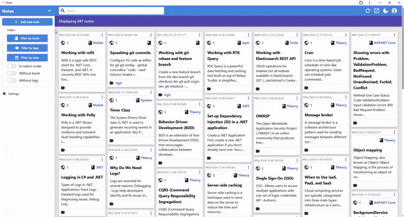

# AspNotes

Note-taking application made with:

- [ASP.NET Core 9.0](https://learn.microsoft.com/en-us/aspnet/core/release-notes/aspnetcore-9.0?view=aspnetcore-9.0)
- [Entity Framework Core 9.0](https://learn.microsoft.com/en-us/ef/)
- [React](https://react.dev/)
- [TypeScript](https://www.typescriptlang.org/)
- [Mantine](https://mantine.dev/)
- [Redux Toolkit](https://redux-toolkit.js.org/)
- [React Router](https://reactrouter.com/)
- [Vite](https://vite.dev/)
- [CKEditor5](https://ckeditor.com/ckeditor-5/)
- [SQLite](https://sqlite.org/)
- [OpenAPI TypeScript](https://openapi-ts.dev/)
- [Playwright](https://playwright.dev/)
- [Feature-Sliced Design (FSD)](https://feature-sliced.github.io/documentation/)

## Table of Contents

- [Features](#features)
- [App Demo](#app-demo)
- [Installation](#installation)
- [License](#license)

## Features

- Ability to group notes by sections, books, and tags.
- Full-text search with SQLite FTS5.
- Ability to add sources to notes.
- Dark theme support.
- Ability to add code snippets to notes.
- Application state is synchronized with the URL.
- REST API with OpenApi documentation.
- User authentication with JWT tokens.

## App Demo

## Installation

`docker compose up --build` \
Application will be available at http://localhost:8080 \
Default user: user@mail.com \
Default password: 123456

## License

This project is licensed under the [MIT license](./LICENSE).
